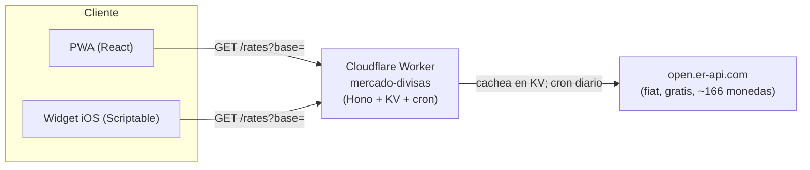

# Divisas

PWA conversora de tipos de cambio con **moneda base configurable** y una lista de
monedas guardada en `localStorage`. Convierte en ambos sentidos (base → lista y
lista → base), es instalable en móvil y trae un **widget de iOS** (Scriptable)
que consume la misma fuente de datos que la app.

**En vivo:**
- App (PWA): https://juan-pablo-lopez.github.io/divisas/
- API (Worker): https://mercado-divisas.tgojp.workers.dev/rates?base=MXN

## Arquitectura



Tanto la PWA como el widget consumen el mismo endpoint `GET /rates?base=XXX` del
Worker, que cachea las tasas en KV y las refresca una vez al día. Contrato:

```json
{ "base": "MXN", "rates": { "USD": 0.0575, "...": 0 },
  "updated": "ISO-8601", "next": "ISO-8601", "source": "open.er-api.com" }
```

## Estructura del repo

| Carpeta | Qué es |
|---|---|
| `frontend/` | PWA en React 19 + Vite 7 + TS. Deploy a GitHub Pages. |
| `worker/` | Cloudflare Worker (Hono + KV + cron) que sirve `/rates`. |
| `widget/` | Script de Scriptable para el widget de iOS + su guía. |
| `design/` | Fuentes de diseño (Affinity `.af`); no se deployan. |

## Notas de datos

- **Frankfurter no sirve** para esta lista: solo cubre 30 divisas del BCE (tiene
  MXN/USD/EUR pero no RSD/BAM/MKD). Por eso la fuente es **open.er-api.com**
  (gratis, sin API key, ~166 monedas fiat).
- Montenegro usa **EUR** (no es una moneda aparte). BAM está anclada al EUR
  (~1.9558) y MKD de-facto anclada.
- Las tasas son **mid-market de referencia**, no incluyen spread bancario.
- Solo fiat: la fuente **no incluye cripto** (BTC, etc.).

## Conversión

El API devuelve `tasa[X]` = unidades de X por 1 unidad de la base.

- Base → Lista (con `monto` de la base, cuánto compras): `montoX = monto * tasa[X]`
- Lista → Base (cuántas unidades de la base cuestan `monto` de X): `montoBase = monto / tasa[X]`

## Desarrollo

### Frontend (`frontend/`)

```bash
cd frontend
npm install
npm run dev      # servidor local (localhost:5173)
npm run lint
npm run build    # tsc -b && vite build
npm run deploy   # build + publica en gh-pages
```

Para apuntar el frontend a un Worker local en vez del de producción:
`VITE_RATES_API=http://localhost:8787 npm run dev`.

### Worker (`worker/`)

```bash
cd worker
npm install
npm run dev      # wrangler dev local (localhost:8787), KV simulado
npm run deploy   # despliega a Cloudflare
npm run tail     # logs en vivo
```

> **Cuenta de Cloudflare:** este proyecto usa una cuenta **personal**. Como el
> entorno exporta `CLOUDFLARE_API_TOKEN`/`CLOUDFLARE_ACCOUNT_ID` de otra cuenta,
> los scripts de `worker/package.json` anteponen
> `env -u CLOUDFLARE_API_TOKEN -u CLOUDFLARE_ACCOUNT_ID` para forzar el login
> OAuth personal (`wrangler login`).

El cron corre a las **01:00 UTC** (tras la publicación diaria de la fuente,
~00:00–00:25 UTC). Al correr en UTC no le afecta el horario de verano.

### Widget (`widget/`)

Ver [`widget/README.md`](widget/README.md) para instalación en Scriptable y la
sintaxis del parámetro (base, monto, dirección, monedas). Nota: en iOS, tocar un
widget de Scriptable siempre abre Scriptable primero — no es evitable.

## Stack

React 19 + Vite 7 + TypeScript, CSS plano con tokens en `:root`, PWA manual
(manifest + meta, sin service worker). Backend: Cloudflare Workers (Hono) + KV,
capa gratuita. Deploy del frontend en GitHub Pages (`gh-pages`). Hermano de
vida-catolica / ruta-98 / guia-infonavit.
